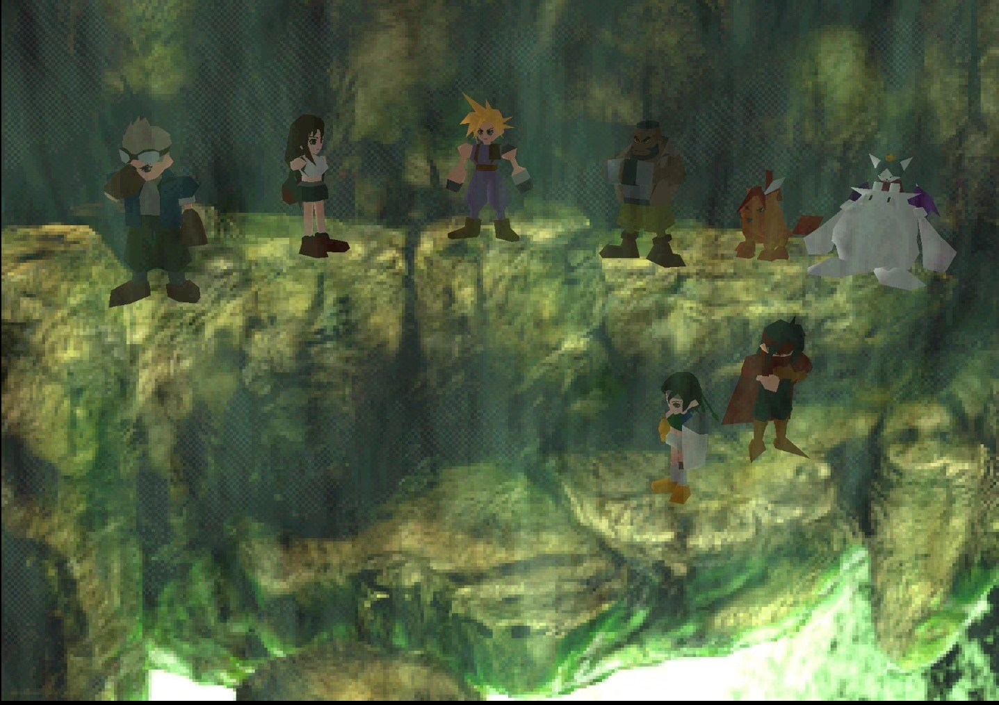

之前通了ff7re的时候就想补一补这23年前的3a大作了，现在终于抽出时间通关了。剧情确实没话说，内容更是丰富的一批。但是可能是我没玩过之前的老游戏，对一些地方有点抱怨和疑问。

第一，野外遇怪不仅是暗雷，概率还高，攻击动画很长很慢，怪还没血条。又拖游戏时间又没战斗体验，很难受。不得不开了修改器不遇怪，不得不说体验好了很多。不过最后打萨菲罗斯还是打了快20分钟，没血条是真的难受。

第二，隐藏内容很多，而且有不少有关剧情的重要内容。不看攻略的话不仅队友集不齐，主线可能都通不了。不知道为什么不设计的简单点，人性化点呢。难道真的是想会长所说，要卖攻略书的吗。

不过不管怎么说，ff7都是一款无与伦比的创时代的巨作。越来越期待重制版的后面几章了。
