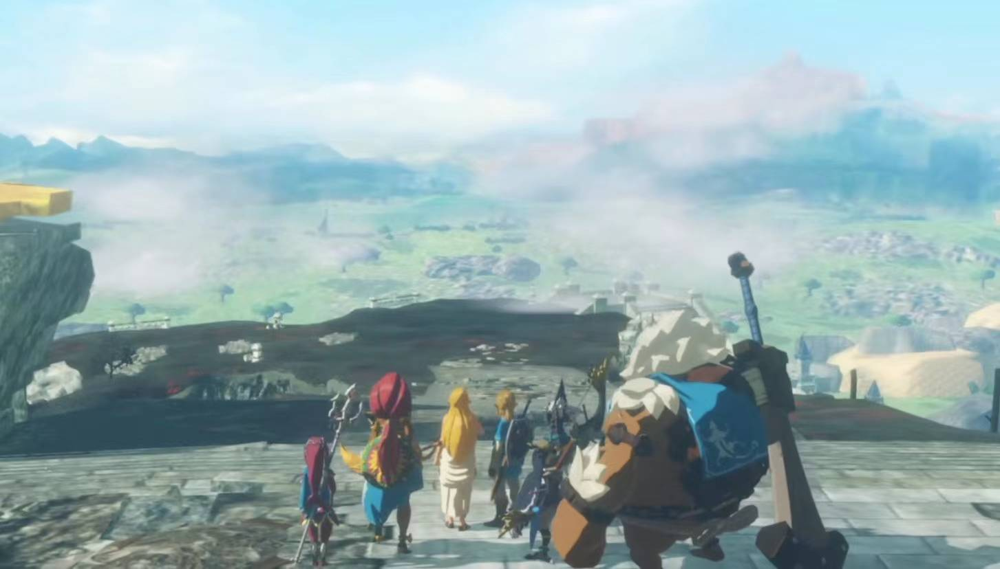

最近玩了许多流程只有10小时左右的游戏，对于我这种一直玩jrpg的人来说，大部分游戏我都觉得流程实在是太短了，没玩够。但灾厄启示录是唯一一个让我打得厌烦并且觉得流程很水的游戏。

剧情很简单，前面一半是旷野之息原作中100年前的内容，除了多了那个小守护者机器人之外没什么新内容。等剧情推动到盖农提前觉醒占领海拉鲁城堡之后，就转到本作的if线了。可能在没被剧透的情况下，看到100年后正作里帮助林克的那四个英杰后代穿越过来的时候还会感到一点惊喜。可惜，我已经知道了，剩下其他if线的剧情我拿脚指头想也基本上能猜出个大概其了。

再说说游戏战斗部分。首先，每一个大关的流程都比较相似与固定，基本都是赶路-打精英怪-赶路-打精英怪的循环。前期的精英怪血量和伤害都很友好，也由于新鲜感，不会感到无趣。可到了后期，流程还是不变得去赶路-刷精英怪。但精英怪却变多了，变肉了，变得伤害高，动作快了。你要说精英怪数量丰富，打着有意思也就算了，每一个精英怪都是换皮，打的套路也只是一直无脑砍弱点槽而已，还放那么多，甚至风火水雷四个盖农都打了不下三遍。我还能说什么呢。不过神兽战还是挺爽的，除了操作比较蹩脚。

可能这就是无双吧。不过同是光荣代工的游戏，p5s不管是剧情还是战斗打的比灾厄启示录师傅舒服多了。

最后，听说这游戏还有几个隐藏人物，不过由于他这个支线任务也全是重复的刷怪，我也懒得打了，修机器人的二周目也懒得弄了。去b站云一云就得了。

之后打算入伊苏和逆转裁判，不过最快也得等下周才能玩到了
