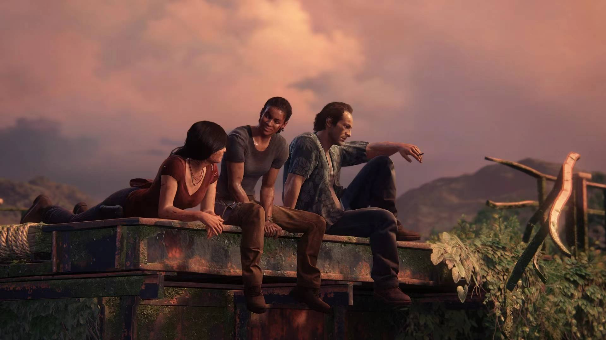

比神海4更上一层楼。作为流程只有15h的神海4的dlc，失落的遗产也是意料之中的短。不过也多亏了这个短，流程中减少了许多爬爬爬的部分，增加了解谜的占比，美到爆炸的景点也是一个接一个。特别是中后期开始，流程紧凑而震撼，真的十分过瘾。

除了流程紧凑很舒服之外，失落的遗产其实和神海4没有太多区别。唯一创新是前期有一个小的开放地图，不过说实话没什么亮眼的地方，除了主线之外，就只有一个满地图找钱币的支线。地图基本也只能开车逛，感觉没什么细节游玩价值。

另外，我觉得神海这种游戏不太适合开放世界，全流程线性下去就ok了。毕竟开放世界地图肯定不能小，地图一大也肯定不能走。但神海又不是gta，一直开车反而没有乐趣。而且地图也很难看，地形全是高低差，看地图还得暂停……不过以首次的试验品来说的话还算是ok的吧。

下一个游戏不太可能是炼金工坊了，可能是如龙2吧，不过还没买呢。怎么说呢，应该说遗憾吗。玩了十分钟不到就不想玩了。人物脸部模型差点意思，其他什么的建模也有点糙，主机模式貌似也没到30帧，走起来头还晕。不过做不能忍的就是语音没有自动播放，哭了。之后有兴趣就再玩玩看，没兴趣直接出了得了。
