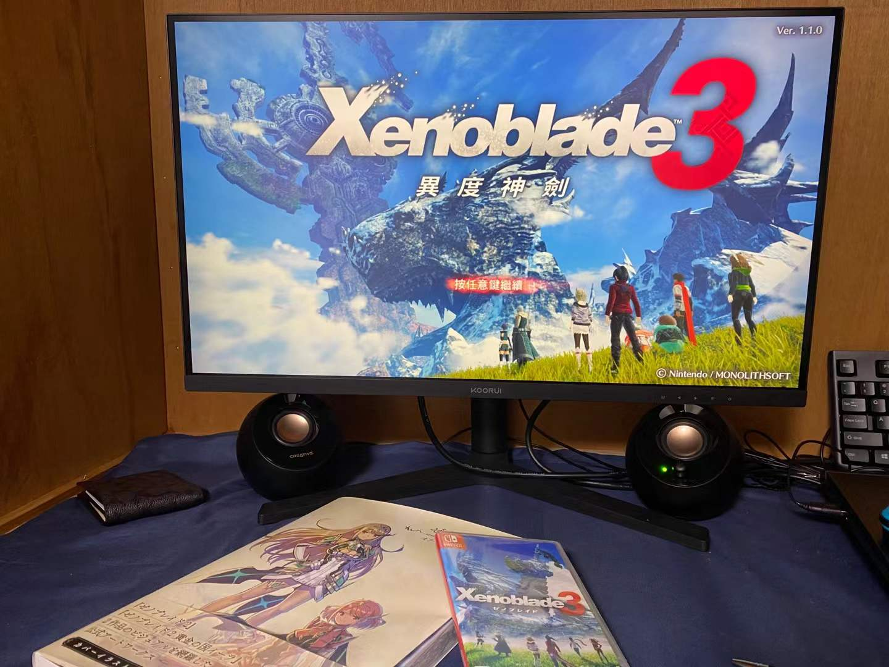

高强度打了半个月，终于通了心心念念的异度3，不过以我自己的感觉来说只能说是一般般。以至于在刚通关的现在回想起来印象最深刻的只有监狱、结尾分离以及那首只被用了两次的反击神曲了。

先说说满意的部分吧，战斗部分，手感什么的都一如既往的不错，职业系统和英雄支线都保证通关之后还有很多内容，保证不会像其他游戏那样一通关就封盘。还有地图设计，这作地图大的可怕，每张图都基本是xb2古拉的那种大小，开图的时候虽然很麻烦但也很快乐。

下面就是缺点，

缺点1，前期太拖了，而且本身剧情量就没有前两作大。前期一直打一堆弱智一样的梅比乌斯，可以说从第二章到第五章进主堡之前剧情是一模一样的，而且这些梅比乌斯过于小丑了，说了半天大话又被衔尾蛇一套秒，真的没什么看点，每次都觉得下章就好起来了下章就好起来了，结果第五章好起来了之后呢，第六章找美雅找尼娅之后就直接最终章了……如果说xb2是碧轨剧情循序渐进高潮迭起一幕接一幕的话，那xb3就好像是闪3（想了半天可能只有闪3还算符合了？）前期还行，中期逐渐无聊，后期刚想说好起来了的时候又飞速结局了……

虽然说没有到闪2或者ff15那种程度，但是我也终于是体会到自己期盼已久的游戏没有达到预期的那种失望了。不过也确实是期望定的太高了，本身一部90分的游戏，你总想着能是个100分的神作，那也是不可能，是吧。

接下来唯一期待的就是黎2了，不过是9月的日文版也好1027的中文版也好，肯定是没法第一时间玩上了，希望不会被剧透太多，有个和xb3差不多的游戏体验吧。
