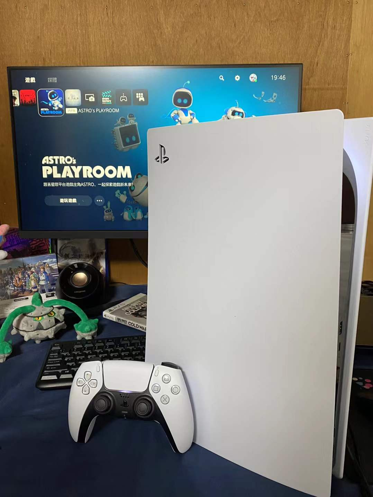

终于体验到ps5手柄了，自适应扳机玩起来确实很爽，但是感觉震动还是没有ns的pro手柄细腻，小机器人里开枪之类的震动久了手会麻，如果把pro手柄的hd震动和ds5的自适应扳机结合起来将会绝杀，可惜现阶段还是差点意思。

虽然玩小机器人最初是为了体验手柄，但是玩起来之后倒也真感受到了箱庭＋平台跳跃的乐趣。当初玩马里奥奥德赛的时候草草通了关，我还以为我对这种游戏没兴趣，可玩小机器人的时候不由自主的就想进行全收集了。全流程下来也只有一个地方确实找不到看了眼攻略，其他都是自己一个一个收集的。现在想想，我认为是因为小机器人体量正合适，在马上要腻的时候就可以全收集然后开下一张图。而奥德赛的那些月亮有的藏的确实深，找不全，而既然很难找全，便完全没有兴趣多找，找够目标就完了。

总体来说是非常不错的小游戏。顺便吐槽一点为什么名字会翻译的这么长啊啊，朋友圈里根本显示不全啊，只能用英文名加简称了……另外ps5说是会统计游戏时长，可是居然不是实时算的，看网上说数据没上传时再继续玩就会被覆盖了。可能是因为这一点游戏时长一直只有1h不到，只能靠体感算时间了，之后的cod也是这个情况。ps5都两年了，只能说做的是真的垃圾。然后小机器人打完估计都快一周了，之前写完不小心按错了没保存，一直又拖到了现在写，马上東迷都要打完了，我想的是趁着还在语校赶紧把神之天平通了吧，再碰ps5游戏估计得等到之后的ff了
