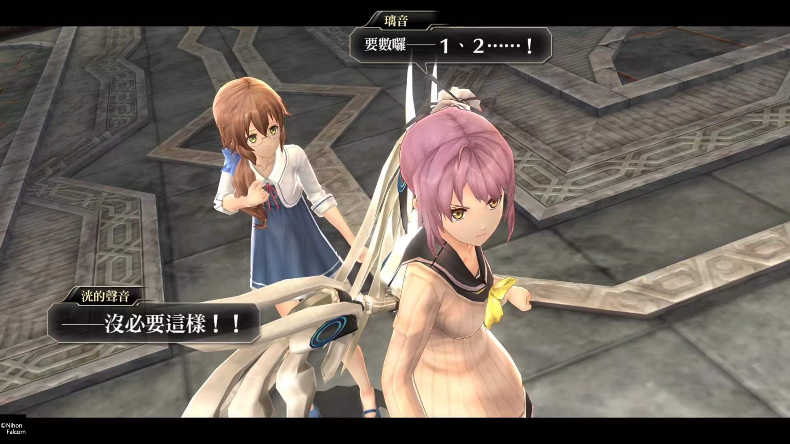

现代版轨迹，轨迹味拉满。法老控还好心的在后日谈里加上了正篇中没出现过的的“没有那个必要”谢谢你法老控。

从头到脚充满着轨迹式套路。可以说是成也轨迹，败也轨迹了。前期每章队友套路式入队，终章找队友，万年不死人，经典一人一句……但也正因为是轨迹，到终章到后日谈看到这些npc的小故事也会会心一笑。这正是轨迹系列的魅力所在吧。

先说说游戏方面，毕竟是法老控，每个角色差异性十足，打起来手感也不错。但是这不是伊苏，是轨迹，搞了个回路系统出来，有的角色孔还给你少一个，真的气人。轨迹里升级孔用七种耀石，简单易懂，但東迷升级孔要用的道具花里胡哨，哪个怪掉第几章能拿完全不知道，搞得我十分混乱，终章全开孔之前都不想好好配回路。其他倒是没什么，迷宫也好手感也罢整个战斗打下来体验也很不错。就是搞了个二周目追加迷宫害得我没拿到迷宫全s和全宝箱的杯，而且第五章雾女真的难，打不过改到普通难度，结果忘了换回来一直普通难度打到了终章……

前面吐槽了半天，还是再细聊聊剧情，由于前面提到的找不到强化道具在哪掉，百度了一下进到了東迷吧，手贱看贴被剧透了，再加上熟知法老控万年不死人＋铁happy ending的尿性，所以深信栞是绝对不会死的，最后也确实复活了。所以最后栞死的时候没有太大触动，再加上传统一人一句搞得很尬，不过第七章和终章，尤其是栞的最终羁绊还是非常不错的。总体来说算是中规中矩的轨迹式rpg吧，后日谈还挖了坑，希望伊苏10之后接原版人马的東迷2，让黎3再缓一年。

还差一个月就大学了，趁这一个月赶紧把神之天平打了，这次千万不要被剧透了！最近在看房，住在郊区是不可避免的了，也希望之后的大学生活能和现在不一样吧
