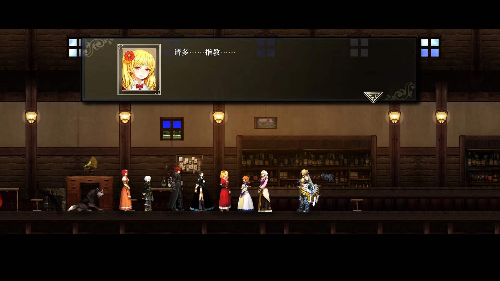

jrpg已经玩一个少一个了……回头真得买3ds玩老游戏了。画风这么廉价却让我一上手就停不下来的游戏真的不多，当时玩零轨空轨那轨还适应了半天呢。不过中间因为搬家等事搁置了半个月左右，没有一口气从头打到尾，算是一点小遗憾吧。

先说战斗部分，开局打第一只史莱姆的时候就感觉到这游戏打击感真的没话说，后面再加上各种凭依技，每章都心甘情愿刷满所有武器了……不过为了不被剧透没看贴吧，到深渊前一直都是拿物理武器慢慢刮痧打的，中期的时候刷怪效率属实低下，而且居然调到中等难度以下就不让调回困难了，后期指令拳魔法扫把刷到之后一路平推，最终boss很轻松就过了体验也不是很好。另外这游戏要刷的东西真的多，不算刷的时间通关时间应该要减半。新章本以为不用刷了，结果居然又有装备盘和新技能，装备盘居然还能装3个……不过正好在打最终boss前刷的差不多了，也算是体量控制得当了。

再说剧情，其实故事大体上没有什么可以吐槽的地方，角色不多但都印象深刻（法老控好好学学x）就是太穷酸了，没有回放和自动播放，有没理解的地方想重新看一眼还要去读档。另外音乐也异常抓耳，主界面bgm很好听！

已经不知道要写什么了，真的是很棒的一款游戏，今天早上通关，一整天打别的游戏都提不起劲了。期待后面的dlc！！！

刚买了卡比和火纹，还有战神4什么的也可以打，不过现在是真的提不起兴趣打，再找找jrpg吧，重打一遍天平也可以，不过好像不能继承存档开二周目，白金就差个困难通关，开个修改器纯看剧情再通一遍好像也不错
