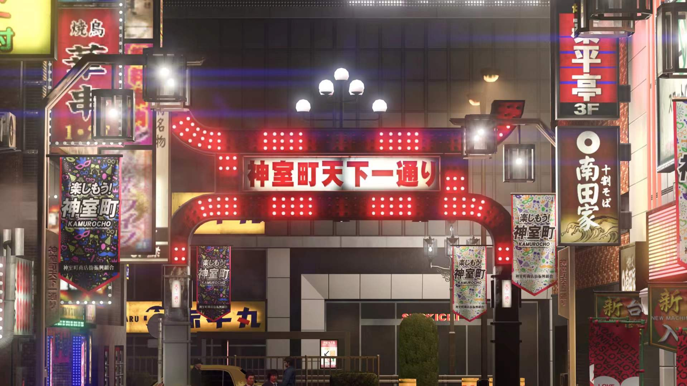

打完7外把8的期待值拉太高了，忘了如龙其实一贯是虎头蛇尾剧情逆天了，不过唯一欣慰的是临终笔记的剧情确实还是很在线的。

先说游玩部分，如龙在这一部分我还是很放心的，不过本作两个重点江湖宝贝和咚咚岛，初见时虽然感觉很惊奇很有趣，但是玩着玩着便感到不对劲了。首先宝可梦模式单纯就是简简单单的堆数值，前期运气好抽到白金直接一路碾压过去了。就算没有白金抽几个金卡肯定也能碾压。完全没有真正宝可梦轮转之类的策略感。动森岛也是，虽然确实很沉迷，一口气打到5星结束了，不过这种其实和潜水员戴夫一样靠不断解锁新东西带来的新鲜感驱动的，一打到结局没新东西了就立刻会感到无聊，我打完5星后除了挂机刷了会钱之外就没再碰过……而且中间一直敲垃圾纯体力劳动很无趣。不过毕竟不是主要部分，在我这已经合格了。江湖宝贝方面我倒是希望能在打磨打磨9代继续玩，毕竟之后回合制肯定也会有江湖宝贝图鉴这么一个东西，再融进去也不突兀。另外春日部分的支线大体还是如龙正常水平，不过也有不少嗯拖时间，救生员当了三回，送水也玩了三回，纯拖。

战斗部分感觉和7代大差不差，战斗中能走体验提升很不错，不过在黎里已经体验过了不觉得惊艳，而且我总感觉黎轨的act＋回合制会是未来为回合制提升爽快感的标准答案。另外有两点问题，第一是aoe技能不能很好显示出能打到谁，尤其是怪站的很远的时候。第二是怪老动打背面打aoe时也瞄不准，很烦躁。第一点我记得7代就有这个问题，打直线aoe时常会漏怪。其他没啥，就是等级设置很奇怪，打完才50级，没dlc又得狂刷才能白。

最后剧情部分，7和7外都不错导致对8的期待值高的一批，结果又回到如龙常规逆天水平了，只能说可惜了。这次剧情主打一个憋屈，桐生一过剧情打架就跪地，春日又一直被搞，还有皮套不停恶心人，中间还把花轮弄死了，结果憋屈到最后也没什么爽点，最后把三岛拉出来又去打小怪了。春日线后面简直没法看，4个boss就舔狗山井塑造还可以，剩下两个小丑一个神棍老登到最后也没解释为什么一直不死。不过唯一支撑我玩下去的桐生线还算可以，临终剧场质量都很好，只不过在狭山和遥的剧情上还是很无语。

也不想再多说什么了，最后把桐生搞的瘦骨如柴的是真的心疼，之后让桐生一马带着真岛冴岛堂岛这哥仨好好休息吧，别再拉出来卖情怀了。

玩完龙8又不知道玩啥了，最近回国买游戏翻着翻着又想整个psp了，等之后再看吧，没啥别的写的了。
