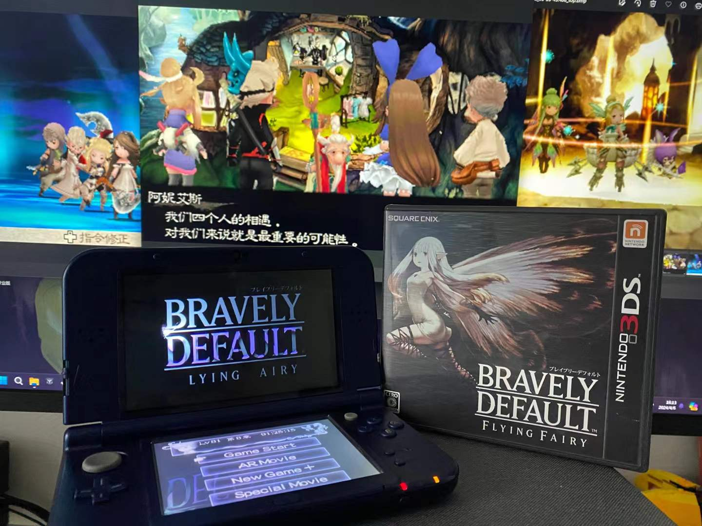

3ds上通关的第一款游戏，没想到居然不是心心念念的究极日月或者节奏天国，而是因为无聊偶然打开的勇气默示录。本作作为3ds上的早期作品，充分利用了3ds的各种机能，开局的ar以及初见各个城镇时的3d画面都给我带来了不少在本世代游戏机或模拟器上感觉不到的震撼。另外擦身通信，网络配信，摄像头等等机能也都有适配，和游戏剧情也有一定的关联。可惜在3ds已经停止服务的今天本作的一些功能已经无法使用，十分遗憾。

战斗方面，一说到bd的战斗系列都在说玩弄回合数的bp系统，完整体验下来发现这套预支回合的bp系统只能算bd系列的基底，bd真正的精髓是各种五花八门的职业了。搭配之下可以达成许多奇妙的战术。我自己不算是爱研究的人，在游玩过程中也组出了不少自认为比攻略里的要强的配置，成就感这块算是拉满了。

游玩方面，虽然采用了jrpg常规的暗雷遇敌设计，但是给了调整遇敌率的选项，无论是刷级还是走迷宫都可以去调遇敌率，还有关闭经验值获取等等实用的选项。就算是十年后本世代的游戏都很少有这种设定。再加上bdff的职业是真的又多又有趣，很想去知道职业升级后给的技能是什么，以至于本作是为数不多的在刷级时有正反馈的游戏。我为了全职业满级估计得刷了十多个小时。不过再一查才发现是完全版特有的机制，首发入的玩家根本没有这些福利，顶着四次轮回无限跑图打怪才通关的玩家估计是真的要被恶心吐了吧ww。另外这游戏文本量是真的大，不仅有两本百页以上的手帐，每一个道具都有一页介绍，老游戏是真的用心了。佩服制作组也佩服汉化组👍🏻

剧情方面，本作剧情在前半部分算得上是十分传统的王道rpg类型，体验算得上中等偏上，每章有大量支线来获取新职业，正面驱动力很强。然而后半部分开始轮回的主线实在是太拖沓了，整整又打了两个轮回才真正揭秘了妖精的身份，虽然标题的藏头很亮眼，但是揭秘后又要忍着妖精再打两轮才能进到真结局属实难绷。很难想象主角团在基本都知道妖精身份的情况下是如何忍下来的。而且我总觉得终章和真终章是不是搞反了？有勇气做出改变搞碎水晶进不了真结局，没勇气改变单纯听信于妖精反而能进真结局打最终boss吗？？不过这么设计估计是怕有的玩家不知道怎么进吧，毕竟bdff算是少见的不用看攻略也能玩的很舒服的老游戏了。还好每次轮回支线的改动不少，能看到支线里各个角色的成长和改变就已经完全盖过重复跑图的枯燥了～

总体来说虽然bdff算的上是一部难得的优秀jrpg了，能让我不去玩ff跑去玩这两作bd……ff7rb发售中间突然玩到了bd，搞的我现在ff7碰都没碰，还怕被剧透扎克斯线。。而且最近这几天也一直在听bdff的bgm，简直是回味无穷。可惜不知道这学期还有没有时间玩了，还攒了不少游戏没玩呢！！！！！
