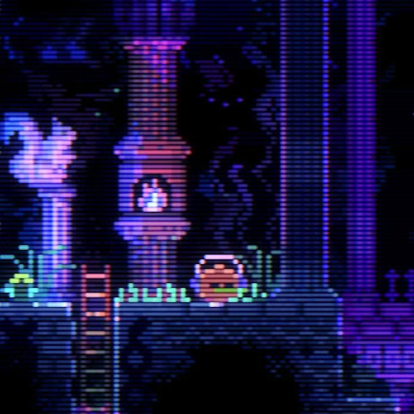

界轨后唯一能让我提起兴趣的游戏。我之前一直觉得我对这种银河城类的探索游戏不感兴趣，空洞骑士买了没玩，之前密特罗德买了也没玩。结果动物井直接高强度打了三天直接白金了。。。

这游戏前期的时候一关接一关正反馈很丰富，而且道具的可玩性也很丰富，尤其是泡泡和飞盘，有的时候用道具到了一些奇怪的地方我都感觉是不是逃课了。前期的时候探索欲望很强，再加上有四大关，也很难出现卡关后不知道要干什么的时候，直接去别的关玩就好了。但是到后期就有点迷茫了，而且有一些很基础的东西也藏的很深。比如笛子，我是根本没想到这玩意还能传送。完全想不到隐藏房那个鱼跳来跳去是这个意思。而且后期隐藏物品的设计我倒是觉得一般。倒不是不能藏的深，只是触发很恶心。基本都要用探照灯去照，相当于不但要重走一遍全图，还要一直切成灯去照。十分麻烦。毕竟这些拿的只是道具，又不是兔子这种隐藏物品。我没看攻略自己玩拿到了差不多50多个蛋，剩下的实在找不到查攻略后才发现大多都是灯照过后陀螺钻地钻出来的。没啥设计就是纯舔图相比其他关卡来说就水的多了。不过总体体验还是很不错的，毕竟后期流程也没多少，也有攻略。之前还说16个兔子就不拿了，结果最后还是都拿了。。毕竟能飞啊ww

另外这个画风也很顺眼，很久没有看到这么舒服或者说这么喜欢的画面了。打完后找了找其他同类型游戏，结果很难找到有对上眼的了。

最近不知道是眼光高了还是找的游戏都太无聊了，试了好多游戏都玩不下去。。这学期都到最后了也才通了两款游戏，其中一个还是独立游戏。。。难受
