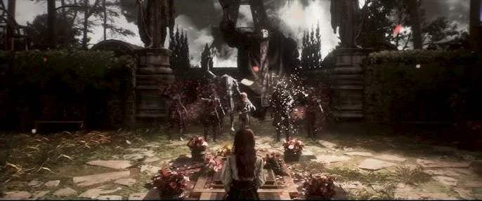

相似中见颠覆。传闻中很像jrpg的法国游戏，现在找到时间终于打了一遍，其实他虽然在大体上有着回合制大地图之类很jrpg的东西，但是无论是战斗系统还是剧情都和传统的jrpg大相径庭，所以下文也就不再继续拿他和其他jrpg做比较了。

先说战斗方面，每个角色都有各自的一套机制，差异性十足。技能符文和武器也很丰富，好像每个人都能搭出一套输出和辅助的构筑。但是我觉得33的这套战斗系统最关键的还是那套防反机制。这个防反不是单纯的减伤这种添头系统，是能无敌+加ap + 反击的核心系统，这就导致他战斗时就必须保持全程的专注，而且为了凸显这个系统的重要，怪的伤害也是很高，吃个两三下伤害可能就直接暴毙了。中前期的时候我还觉得很不可理喻，但是到后面熟络起来后发现为了防反，每个怪的攻击动作在很华丽的同时都有很明确的节奏，完防后反击的正反馈也很足。可见还是下了很大的功夫的。不过也正如前面所说因为格挡系统是极端的免伤，所以怪的伤害基本都很高，在前期每次进新图没有熟悉怪物的攻击模式时，都很容易暴毙团灭，打起来也很难受。所以说这整套系统的想法是没问题的，完防系统有足够的正反馈和紧张感，但是会和其他数值有矛盾，如果怪的伤害低那完防就没用了，如果全靠完防那么防御和怪的攻击之类数值就完全没用了。

然后说玩法方面，我觉得主要的问题就是数值设计的失衡和后期流程设计割裂。数值方面和战斗系统相关，但是这两个问题是相辅相成的所以一块说。中前期伤害上限是9999，但是这个数字我基本在第二章初这个中期的位置就能打出来了，在第二章后半期我的输出角色更是基本上每一下伤害都是上限。所以在后期打完绘母能突破伤害上限并且可以完全探索大地图时，我以为我的角色算是练度高的那档了，结果进了几个新地图都打不过，还是完全不掉血的那种。最后还是看的攻略，把资源全部倾斜到玛埃尔上，再刷了会级，这下又能直接一个司汤达症秒boss了，可以说是从一个极端走到了另一个极端。而且从终章地图里的奖励来看，官方就推荐不探索大地图直接接着打，但是对于这种把不少细节剧情放到了大地图支线里的这种流程是挺不合理的，不过好在有能调血量的挑战系统，刷到满级后，把最终boss血量x10再打起来就能稍微有来有回一点了。这也可见数值的差距之大。不过这游戏的演出和音乐真的是顶级的，最后打雷诺阿无论是音乐还是技能的动作，身后四个超大的车由泰坦的压迫感，再或者是特殊的剧情演出初见时都十分震撼，还有打克莱雅的时候召唤各种经怪的技能莫名有种节奏天国总集篇的感觉，都挺印象深刻的。

另外再说一下这游戏的地图，我觉得设计的很不错，藏的东西很多，但是没有任何标识和指示的方向，实在是太容易迷路了。如果单纯直走过剧情的话还好，如果想找收藏品就直接要转得晕头转向了，经常是转了很大一圈然后发现回到入口了，也不知道收集品有没有收全，再想回去也找不到路了，很难受。搞得我最后根本没有什么探索的欲望，要么草草了事，要么就只能跟着攻略走了。

最后是剧情部分，我觉得33的剧情还是很有意思的。其实我感觉在进第二章之前都没有什么新奇的部分，还以为只是一个打绘母的王道故事，直到后面老古在第一章末就死了，然后第二章打完绘母还有反转，剧情确实非常新颖而且很引人入胜，还有各种隐藏细节和暗喻，再搭配上出色的演出和音乐，确实可以算得上神作了。

其他的不多说了，新学期又开始了，不知道这学期能怎么样，下一个可能是黑白莫比乌斯吧。
