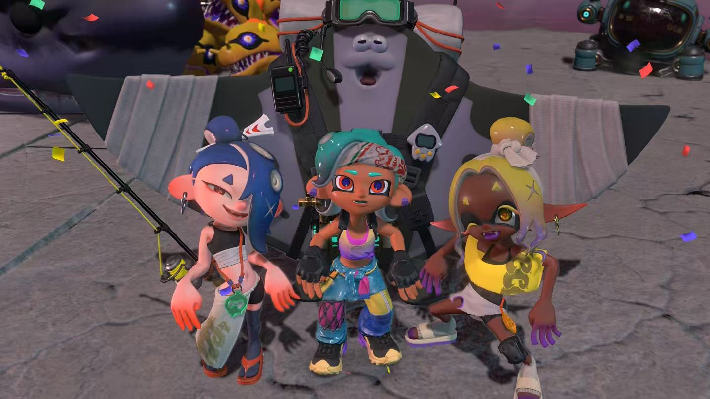

打工是喷喷最好玩的模式。我当时玩喷3，对战玩起来很难，上手难，精通难，想打得爽也很难。于是玩到了打工这个很有特点的pve模式。非常沉迷。本作这个单人打工模式，虽然很快让我又重新找到了当年疯狂打999的时光，但是我觉得本作并没有超越喷3的打工，成为真正一个有特色的旁支作品。

首先大概关卡分为三块，挖大晶石的关卡，基本没有什么有趣的地图设计，大多就只是赶路+打怪。尤其是其中大世界关卡需要重复不断的赶路+打怪，尤其无聊。

罗盘的类解谜关卡，大多也只是武器介绍，没有太深入的运用或者组合运用，只有后期少量隐藏关有不错的感觉。

然后是类打工的纯打架图，这种确实是最有意思的，单独的特化地图也能让我眼前一亮，特别是三个塔的那个跑酷关，点名表扬。

其实这些普通图都好说，我觉得最遗憾的是boss实在是太少了，将近四五十个关卡中只有3个boss。而且每个boss的招式动作也并不丰富。我初见第一个boss的那个大翅膀鲑鱼时，很高兴，结果才发现这个就是质量最高的boss了，后面的火车和冰河豚，一个比一个敷衍。我觉得是只有多做这种有特点的boss才是和喷3本体打工做出区分的方法，特色只有刷回廊，和打工每期去打999反而没有本质的区别。

然后说这个游戏的刷子本质，我是受不了了，不想再做重复劳动了。首先这个令人发指的点就是，给的资源实在是太少了，少的可怜。我通关后回廊打到差不多50层，不多，但是肯定也不算少了。其中爆的彩色武器只有少少的两把。每把给的矿石更是只有一两千，要知道后期强化配件每一个都是两三万起步的。而社区中的刷法也只有手柄宏这一种，所有主流解法是宏的东西，我觉得都是设计有问题的东西。我不知道回廊有没有上限，但既然不止一百层，那为什么不能慷慨一些，把爆率调高，让玩家可以平稳地从通关配置过渡到半成型呢。我刷到50层回廊，基本看不到完成配置的希望。所以导致我完全没有想要再继续刷的想法了。更何况我并没有看社区的通用最强解，只是用了我习惯的配置，如果后期发现这个配置强度一般，又回浪费巨量的资源。

不过别的不说，喷的打工确实是很有意思的模式。现在回国了，希望可以多打几个游戏吧，哈哈
